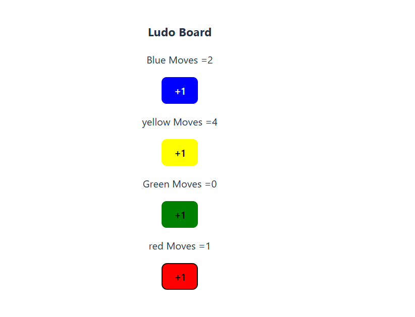

## Ludo-Game

--

Ludo Game ek popular board game ka digital version hai jise ReactJS ke zariye develop kiya gaya hai. Is game me 2 se 4 players tak participate kar sakte hain aur apne tokens ko board par move karte hain. Jo player pehle apne sare tokens ko home position tak pahucha deta hai, wahi game ka winner hota hai.

## Features

- Multiplayer support (2-4 players)
- Dice roll simulation
- Tokens ka movement according to dice
- Safe zones and capturing opponent tokens
- User-friendly interface built with ReactJS
- Responsive design jo different screen sizes pe acha dikhta hai

## How to Play

1. Players apne turn ka intezar karte hain.
2. Dice roll kar ke number ke hisaab se apne tokens move karte hain.
3. Agar koi token opponent ke token wale square par aata hai to opponent ka token wapas start position par chala jata hai.
4. Sabhi tokens ko apne home tak pahuchana hota hai.
5. Jo pehle apne sare tokens ko home tak le jata hai, wahi jeet jata hai.

---

Is project ko explore karne ke liye code ko clone karein, dependencies install karein, aur apne local machine par run karein.

 